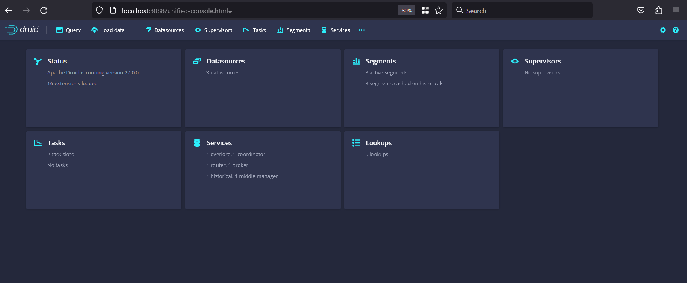
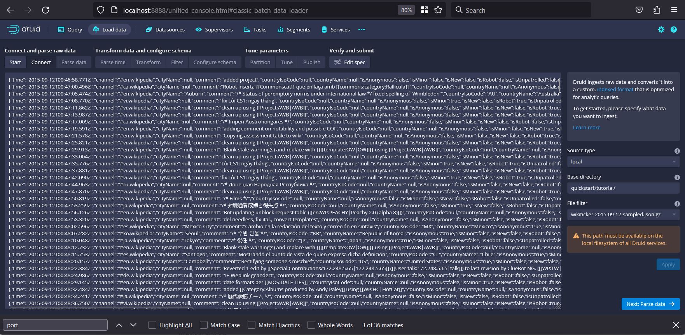

## Learning Apache Druid

 <p>
<div class="column">
    
  </div>
 </p>

### Quickstart guide

#### Installing Druid

Download the latest release from its [official downloads page](https://www.apache.org/dyn/closer.cgi?path=/druid/27.0.0/apache-druid-27.0.0-bin.tar.gz) and once you have dowloaded the tar file you can extract it in your home directory:

```bash
tar -xzf apache-druid-27.0.0-bin.tar.gz
cd apache-druid-27.0.0
```

#### Starting up Druid services

Once you are in `apache-druid-27.0.0` root directory you can run the `start-druid` script by running:

```bash
./bin/start-druid
```

Eventhough is recommended to use just a portion of your available system memory. To explicitly set the total memory available to Druid, pass a value for the memory parameter by running instead

```bash
./bin/start-druid -m 16g.
```

After starting the Druid services, open the web console at http://localhost:8888 and this is the UI you will have access:

  


### [Loading data](https://druid.apache.org/docs/latest/tutorials/tutorial-batch/#loading-data-with-a-spec-via-console)

You can load data in your Druid cluster using the console, batch ingestion through a spec task, and using a script from the Druid installation files.

#### Loading data through the console

The Druid distribution bundles the `wikiticker-2015-09-12-sampled.json.gz` sample dataset that you can use for testing. The sample dataset is located in the *quickstart/tutorial/* folder, accessible from the Druid root directory, and represents Wikipedia page edits for a given day.

Follow these steps to load the sample Wikipedia dataset:

1. In the Query view, click Connect external data.

2. Select the Local disk tile and enter the following values:

Base directory: `quickstart/tutorial/`

File filter: `wikiticker-2015-09-12-sampled.json.gz`

  

