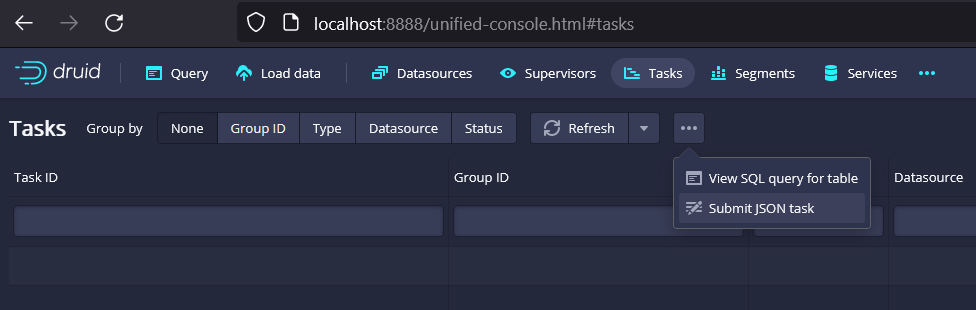

## Learning Apache Druid

 <p>
<div class="column">
    
  </div>
 </p>

### Quickstart guide

#### Installing Druid

Download the latest release from its [official downloads page](https://www.apache.org/dyn/closer.cgi?path=/druid/27.0.0/apache-druid-27.0.0-bin.tar.gz) and once you have dowloaded the tar file you can extract it in your home directory:

```bash
tar -xzf apache-druid-27.0.0-bin.tar.gz
cd apache-druid-27.0.0
```

#### Starting up Druid services

Once you are in `apache-druid-27.0.0` root directory you can run the `start-druid` script by running:

```bash
./bin/start-druid
```

Eventhough is recommended to use just a portion of your available system memory. To explicitly set the total memory available to Druid, pass a value for the memory parameter by running instead

```bash
./bin/start-druid -m 16g.
```

After starting the Druid services, open the web console at http://localhost:8888 and this is the UI you will have access:

  


### [Loading_data](https://druid.apache.org/docs/latest/tutorials/tutorial-batch/#loading-data-with-a-spec-via-console)

You can load data in your Druid cluster using the console, batch ingestion through a spec task, and using a script from the Druid installation files.

#### Loading data through the console

The Druid distribution bundles the `wikiticker-2015-09-12-sampled.json.gz` sample dataset that you can use for testing. The sample dataset is located in the *quickstart/tutorial/* folder, accessible from the Druid root directory, and represents Wikipedia page edits for a given day.

Follow these steps to load the sample Wikipedia dataset:

1. In the Query view, click Connect external data.

2. Select the Local disk tile and enter the following values:

Base directory: `quickstart/tutorial/`

File filter: `wikiticker-2015-09-12-sampled.json.gz`

  

#### Loading data through a spec file

You can also submit an ingestion task spec to the Druid Overlord. You can write ingestion specs by hand or using the data loader built into the web console.

Once you have prepared an ingestion spec like the one loaded in the [data_load folder of this repo](https://github.com/fvgm-spec/medium_notebooks/tree/main/apache_druid/data_load) you can be able to start a batch ingestion task spec in the console by going to Tasks >> 3 dots and then `submit JSON task` 

  

#### Loading data through a script

Druid package includes a batch ingestion helper script at `bin/post-index-task`. This script will POST an ingestion task to the Druid Overlord at port 8081.

You can run the following command from Druid package root:

```bash
bin/post-index-task --file quickstart/tutorial/wikipedia-top-pages.json --url http://localhost:8081
```

This script assumes that you are ingesting the file called `rollup-index.json` located in *quickstart/tutorial/* folder.


