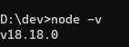

## Database Documentation with dbdocs & dbdiagram

  

This repository contains detailed steps on how to setup your environment to work with [dbdocs](https://dbdocs.io/) and [dbdiagram](https://dbdiagram.io/home?utm_source=dbdocs) in the command-line and with the web UI.

The fist step is to install the latest version of NodeJS if not installed in your machine, if you need help on this here is a very [well-explained guide](https://phoenixnap.com/kb/install-node-js-npm-on-windows). Make sure also that npm is installed.

  

You can also follow the steps detailed in the [official documentation](https://dbdocs.io/docs), which by the way, is very well explained, first you will need to install dbdocs using npm:

```cmd
npm install -g dbdocs
```


