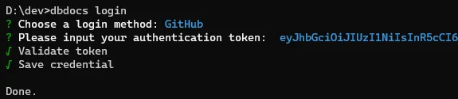

## Database Documentation with dbdocs & dbdiagram

### Basic setup

  

This repository contains detailed steps on how to setup your environment to work with [dbdocs](https://dbdocs.io/) and [dbdiagram](https://dbdiagram.io/home?utm_source=dbdocs) in the command-line and with the web UI.

The fist step is to install the latest version of NodeJS if not installed in your machine, if you need help on this here is a very [well-explained guide](https://phoenixnap.com/kb/install-node-js-npm-on-windows). Make sure also that npm is installed.

  

You can also follow the steps detailed in the [official documentation](https://dbdocs.io/docs), which by the way, is very well explained, first you will need to install dbdocs using npm:

```cmd
npm install -g dbdocs
```

you will get this output in your console:

  

Then you will be asked to login to dbdocs so you can start executing dbdocs commands:

  

It's recommended to install DBML, which is an open-source DSL language specially designed to define and document database schemas and structures. Can be installed also using npm by running:

```cmd
npm install -g @dbml/cli
```

And also DBML VSCodeextension from this [link](https://marketplace.visualstudio.com/items?itemName=duynvu.dbml-language) 


### Use case

You can follow the steps detailed in this [link](https://dbdocs.io/docs?source) to start generating your first dbdoc, and also follow the steps of the [tutorial](https://medium.com/@felixvidalgu/simplifying-database-documentation-with-dbdocs-dbdiagram-d087110c9bbe) I wrote as a companion of these repo.
